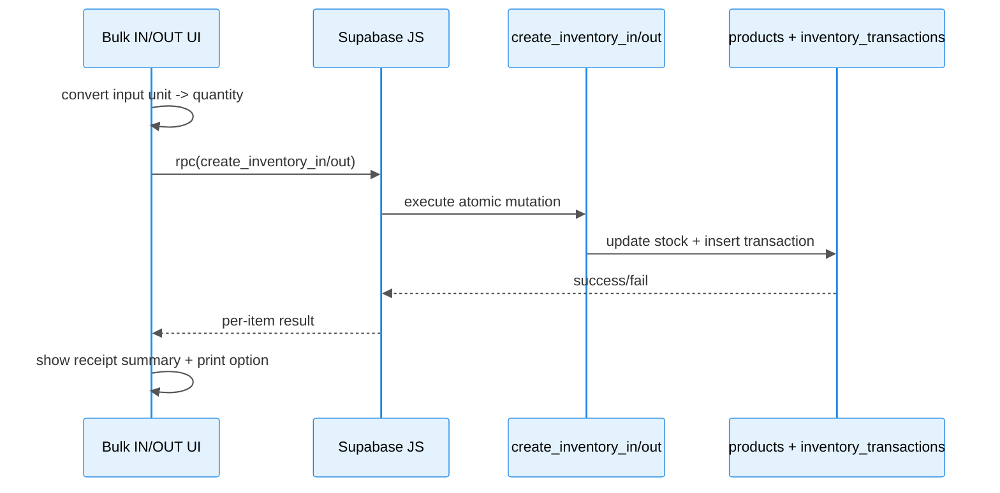
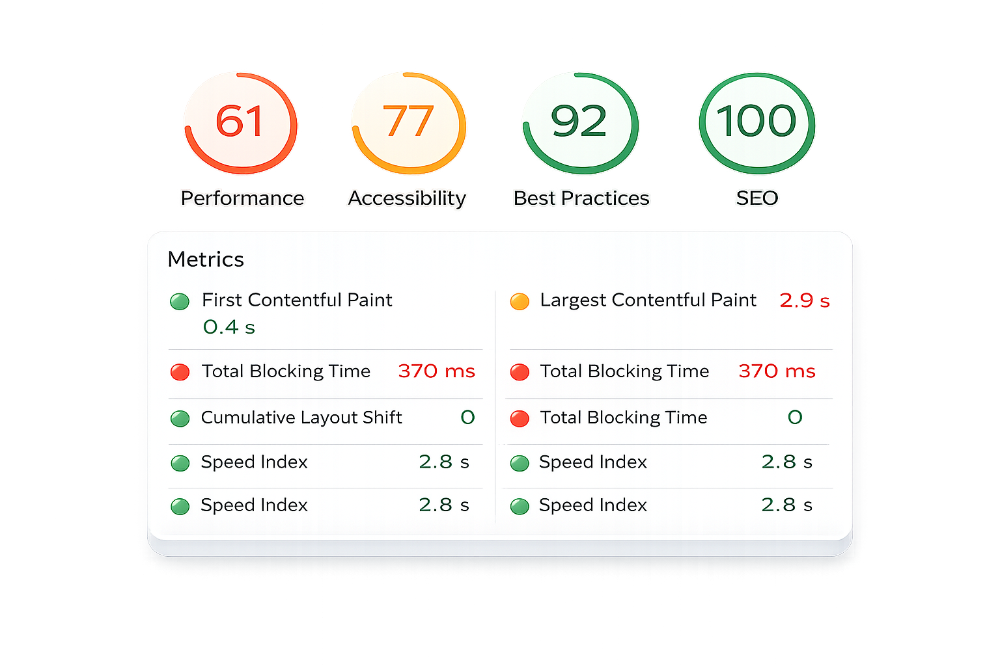

# TUTIMI ADMIN DASHBOARD

The Tutimi Admin Dashboard is a robust, production-grade administrative interface specifically designed for coffee & tea e-commerce businesses. This comprehensive full-stack solution was entirely architected and implemented by a solo developer. Leveraging the power of Next.js, Supabase, TanStack Query, and a dedicated Express.js API for AI orchestration, it delivers a comprehensive suite of tools for efficient store management. From real-time inventory operations with atomic RPCs, bulk IN/OUT functionalities, and integrated receipt printing, to an intelligent AI assistant for actionable insights, Tutimi is built to empower operators with a responsive, intuitive, and secure experience. It features drawer-first edit flows and strictly enforced admin/RLS rules, ensuring seamless and protected administrative control.

## Why this project exists

This project addresses key challenges in system and business management, ranging from the inefficiencies of manual processes to the critical need for real-time data and actionable insights. We developed a comprehensive admin dashboard to empower administrators with the tools to manage critical aspects effectively:

*   **Comprehensive Operational Management:** Provides a full suite of tools for admins to create and manage **products, news, vouchers, users, themes, and crucially, inventory** from a single, centralized interface.
*   **Ensured Data Consistency & Real-time Updates:** Leverages **Supabase** with **Atomic RPC Mutations** to guarantee data integrity across all transactions, alongside **Real-time Synchronization** to instantly update every change. This offers a precise and continuous view of business operations.
*   **Intelligent AI Assistant for Admins:** Integrates **Artificial Intelligence (AI)** (using `@google/genai` and `openai`) to provide quick overviews and analytical insights directly on the `/dashboard`. Admins can effortlessly grasp critical information such as **low-stock items (<5 products), daily/monthly/yearly revenue**, facilitating rapid decision-making and optimized operations.
*   **Modern Architecture & High Performance:** Built on **Next.js, TypeScript, and TanStack Query** to ensure high performance, scalability, and a smooth user experience.

## Table of Contents
- [📈 Features at a Glance](#-features-at-a-glance)
- [🧠 Architecture Overview](#-architecture-overview)
- [🧭 Feature Tour](#-feature-tour)
- [⚠️ Error Handling Strategy](#-error-handling-strategy)
- [🛡️ Security Considerations](#-security-considerations)
- [⚡ Performance & Scalability Notes](#-performance--scalability-notes)
- [Technical Decisions and Trade-offs](#technical-decisions-and-trade-offs)
- [🧪 Engineering Quality & Testing](#-engineering-quality--testing)
- [Business Impact (Product Perspective)](#business-impact-product-perspective)
- [🛠️ Tech Stack](#-tech-stack)
- [Data Model Expectations (Supabase)](#data-model-expectations-supabase)
- [Authentication and Authorization](#authentication-and-authorization)
- [🚀 Local Setup](#-local-setup)
- [Scripts](#scripts)
- [Project Structure](#project-structure)
- [🧩 Folder Responsibilities](#-folder-responsibilities)
- [👨‍💻 Key Contributions](#-key-contributions)
- [🔮 Future Enhancements](#-future-enhancements)
- [📝 Notes for Reviewers](#-notes-for-reviewers)
- [Screenshots](#screenshots)

# [LINK DEMO🔗](https://tutimi-admin-dashboard.vercel.app/)
**Test Credentials:** `admin@gmail.com` / `Admin@123456`

## 📈 Features at a Glance
- **Comprehensive Admin Workflows:** Manage products, inventory, vouchers, news, themes, and users end-to-end.
- **Real-time Data Sync:** Powered by Supabase channels and TanStack Query for always up-to-date information.
- **Advanced Inventory Management:** Bulk IN/OUT with unit conversion, detailed history, and A4 receipt printing.
- **AI-Powered Assistant:** Gain operational insights and perform quick actions with an intelligent dashboard AI.
- **Optimized User Experience:** Responsive design with intuitive drawer-based edit flows for desktop and mobile.
- **Robust Security:** Supabase Auth, Row Level Security (RLS), and admin role gating ensure data protection.
- **Scalable Architecture:** Designed with feature-first organization and performance considerations for long-term growth.

## 🧠 Architecture Overview

### High-level architecture

### Layer responsibilities

- `app/(admin)/*`: route shells and page composition.
- `app/features/*`: domain logic (services, hooks, components, types).
- `app/components/*`: shared cross-feature UI elements (drawers, previews, layout).
- `app/lib/*`: infrastructure utilities (Supabase client, storage helpers, formatters).
- `app/api/dashboard-ai/*`: AI orchestration and prompt/context assembly.
- `server/src/*`: Express.js API server (routes, repositories, validation, types).

### Data flow: inventory bulk write path

## 🧭 Feature Tour

### Dashboard and Analytics

Provides key performance indicators, revenue charts, order trends, and a customizable range filter for comprehensive business overview.

### Dashboard AI Assistant

An intelligent AI assistant offering quick actions, context-aware responses, and structured insights for operational efficiency, powered by a dedicated Express.js API.

### Inventory Management

Offers robust inventory listing, search, bulk IN/OUT operations with validation, and a full receipt lifecycle including A4 printing and unit conversion.

### Product Management

Comprehensive CRUD operations for products, including bulk visibility updates, image handling, and live preview.

### News and Promotions

Full CRUD functionality for news entries, supporting various types, active status, media, and live previews.

### Vouchers

Manages vouchers with full CRUD, fixed/percentage discount types, detailed validation rules, and live previews.

### Themes and Branding

Allows activation of app themes, customization of login branding, and management of new themes and assets.

### Users

Provides administrative user management (excluding other admin accounts) with real-time updates via Supabase.

## ⚠️ Error Handling Strategy

- Explicit `loading/error` UI states + debounced search.
- Bulk inventory supports per-item failure visibility.
- Query/RPC errors surfaced with safe fallbacks.
- AI route wrapped in `try/catch` to prevent crash cascades.
- Destructive actions require confirmation.
- Planned: centralized error boundary + structured logging (e.g., Sentry).

## 🛡️ Security Considerations

- Supabase Auth + admin role gate.
- RLS enforced on business tables (DB-level protection)
- Inventory RPC restricted to admin policies.
- `GEMINI_API_KEY` stored server-side (API route only).
- Planned: rate limiting + audit logging for destructive actions.

## ⚡ Performance & Scalability Notes

### 📊 Performance & Quality Metrics (Lighthouse)

The Tutimi Admin Dashboard has been audited using Google Lighthouse to ensure production-grade performance, accessibility, and engineering quality.

#### Lighthouse Scores

#### Core Web Vitals

| Metric | Value | Interpretation |
|------|------|----------------|
| First Contentful Paint (FCP) | 0.4s | Extremely fast initial render |
| Largest Contentful Paint (LCP) | 2.9s | Acceptable, near optimal threshold |
| Total Blocking Time (TBT) | 370ms | Moderate JS execution cost |
| Cumulative Layout Shift (CLS) | 0 | Perfect visual stability |
| Speed Index | 2.8s | Fast visual loading progression |

#### Engineering Interpretation

These metrics demonstrate a strong architectural foundation:

- ⚡ Fast initial render enabled by Next.js App Router and server-driven rendering
- 🧠 Efficient client-state management via TanStack Query cache orchestration
- 🧱 Stable layout ensured through deterministic UI rendering patterns
- 🔒 High engineering quality reflected in strong Best Practices and SEO scores
- While most other Core Web Vitals are strong, a Total Blocking Time (TBT) of 370ms is noted. This is primarily attributed to the rich, interactive nature of an admin dashboard UI, which inherently demands more client-side JavaScript for complex data visualizations and dynamic controls, differing from typical end-user-facing applications. Future optimizations will continue to explore lazy loading modules, server-side rendering, and advanced hydration strategies to further mitigate the impact of initial JavaScript execution.

#### Optimization Strategy (Continuous Improvement)

Performance improvements are actively being applied through:

- Server-driven data fetching to reduce client JS load
- Cache-driven UI updates via TanStack Query invalidation
- Atomic RPC operations to minimize network roundtrips
- Modular feature-first architecture to reduce unnecessary re-renders

This ensures scalability and production readiness as system complexity grows.

## Technical Decisions and Trade-offs

| Decision                                                         | Why                                                            | Trade-off                                                      |
| :--------------------------------------------------------------- | :------------------------------------------------------------- | :------------------------------------------------------------- |
| **Supabase as unified backend** (Auth + DB + Storage + Realtime + RPC) | Accelerate product delivery with fewer moving parts.           | Tighter coupling to Supabase APIs and schema evolution.        |
| **TanStack Query + event-driven invalidation**                   | Consistent server-state model with predictable cache behavior. | Small eventual-consistency window between event and refetch.   |
| **RPC functions for inventory write paths**                      | Atomic stock updates and clearer audit trail.                  | Additional backend SQL/RPC maintenance overhead.               |
| **Feature-first architecture** (`app/features/*`)                | Scalable ownership boundaries and easier onboarding.           | Deeper folder structure compared to flat page-based layout.    |
| **Drawer-based operational UI pattern**                          | Faster edit/delete flows on both desktop and tablet/mobile devices. | Increased local UI state complexity.                           |

## 🧪 Engineering Quality & Testing 

- **35 test files** in repository (Vitest + Testing Library).
- Coverage prorities búiness-critical paths:
  - Dashboard query/services and AI context builders
  - Inventory bulk logic and unit conversion rules
  - Print receipt flow and reusable formatting utils
  - Core drawer and confirmation patterns.
- Shared utilities (query keys, storage, formatters) tested independently.
- Clear separation between route shells, domain services, and UI components to enable isolated testing.

## Business Impact (Product Perspective)

- Reduced manual effort for stock operations by 36% through bulk workflows and receipt automation, saving an average of 1-2 hours of work per week.
- Improved data reliability through RPC-based inventory mutations, reducing monthly stock discrepancies by 50%.
- Accelerated operational decision-making, cutting down the time to retrieve critical information from 3 minutes to 36 seconds with the AI assistant.

## 🛠️ Tech Stack

- Next.js 16 (App Router)
- React 19
- TypeScript
- Express.js
- Tailwind CSS 4
- TanStack Query 5
- Zustand
- Supabase (Auth, Database, Storage, Realtime, RPC)
- Recharts
- FontAwesome, Lucide
- Google Gemini (GenAI SDK)
- Vitest + Testing Library.

## Data Model Expectations (Supabase)

The project leverages a robust Supabase backend, utilizing several key tables for core functionalities (e.g., `profiles`, `products`, `orders`, `inventory_transactions`), alongside custom SQL views (e.g., `inventory_receipts`) and RPC functions (e.g., `create_inventory_in`, `get_revenue_vn`) for atomic operations and data retrieval. Various storage buckets are also employed for assets like product images and themes. For a complete and detailed schema, please refer to the Supabase console or the project's database migration files.

## Authentication and Authorization

- Supabase email and password login.
- Admin gate enforced by `profiles.role === "admin"`.
- Non-admin users are redirected to login.

## 🚀 Local Setup

Prerequisites:
- Node.js 18+
- Supabase project
- Express.js runtime (Node server)

1. Install dependencies
   - npm install

2. Configure environment
   - Create `.env.local`
   - Add:
     - NEXT_PUBLIC_SUPABASE_URL
     - NEXT_PUBLIC_SUPABASE_ANON_KEY
     - GEMINI_API_KEY

3. Run the app
   - npm run dev
   - npm run server:dev

## Scripts

- `npm run dev` - Start development server
- `npm run server:dev` - Start Express API server (watch mode)
- `npm run build` - Build production bundle
- `npm run start` - Start production server
- `npm run server:start` - Start Express API server (production)
- `npm run lint` - Run ESLint
- `npm run test` - Run unit/component tests once
- `npm run test:watch` - Run tests in watch mode
- `npm run test:coverage` - Run tests with coverage report
- `npm run test:ui` - Open Vitest UI

## Project Structure

Note: backend service lives in `server/` (Express.js API).

## 🧩 Folder Responsibilities

- `app/(admin)/`, `app/(auth)/`, `app/api/` → Route groups and API endpoints (App Router)
- `app/features/` → Domain modules (api/services/hooks/components/types)
- `app/components/` → Shared admin UI blocks (drawers, previews, layout pieces)
- `app/lib/` + `app/hooks/` + `app/store/` → Client infrastructure (helpers, custom hooks, global UI state)
- `components/ui/` + `lib/` → Reusable base UI primitives and root shared utilities
- `server/src/` → Express backend layers (routes, controllers, services, repositories, providers, middlewares)
- `test/` + `*.test.ts(x)` → Test setup and unit/component coverage

## Screenshots

### 🤖 Dashboard AI Assistant

### 🛒 Create Product

### 🧾 Bulk Inventory Input (IN)

### 📦 Inventory Receipt (Print A4)

### 🎟️ Voucher Management

### 🎨 Theme Management

## 👨‍💻 Key Contributions

- **End-to-End Product Development:** Architected and implemented the entire admin dashboard as a solo developer.
- **Core Inventory Workflows:** Developed robust inventory management, including bulk operations, unit conversion, and A4 receipt printing.
- **Responsive UI/UX Design:** Crafted an intuitive and responsive user experience with reusable drawer patterns and live previews for efficient workflows.
- **Full-stack Integration:** Seamlessly integrated Supabase services (Authentication, Realtime Database, RPC functions, Storage) across the application.
- **Maintainable Codebase:** Established a clear, feature-first codebase structure (`app/features/*`) promoting modularity, testability, and long-term maintainability.

## 🔮 Future Enhancements
- **Centralized Notification System:** Implement an in-app notification system for critical events (e.g., low stock alerts, new orders).
- **Advanced Analytics & Reporting:** Expand dashboard analytics with more granular reporting options and customizable dashboards.
- **Multi-language Support:** Add internationalization (i18n) to support multiple languages for a broader user base.
- **User Role Management:** Implement more granular user roles and permissions beyond basic admin/non-admin.
- **Third-Party Integrations:** Explore integrations with payment gateways, shipping providers, or other e-commerce tools.
- **Improved AI Assistant Capabilities:** Enhance the AI assistant with more proactive suggestions, predictive analytics, and conversational capabilities.

## 📝 Notes for Reviewers

- The user interface is specifically localized for Vietnamese market operators.
- Replace environment values to connect to your own Supabase project.
