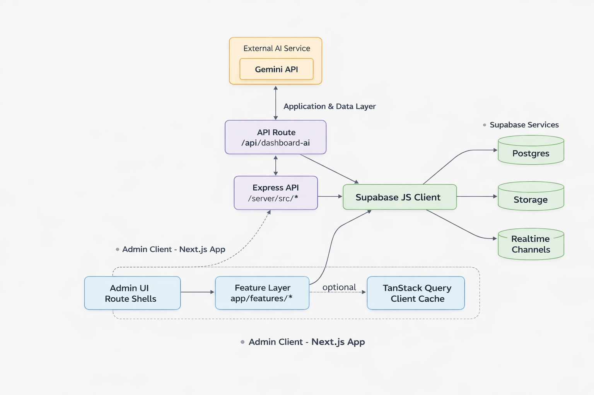
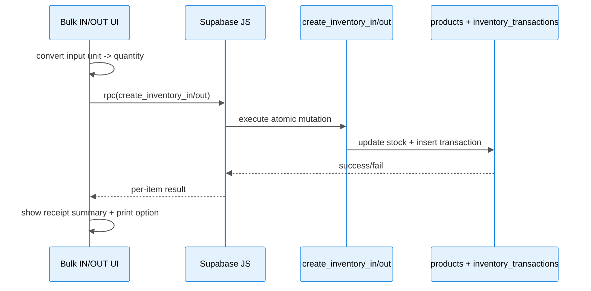
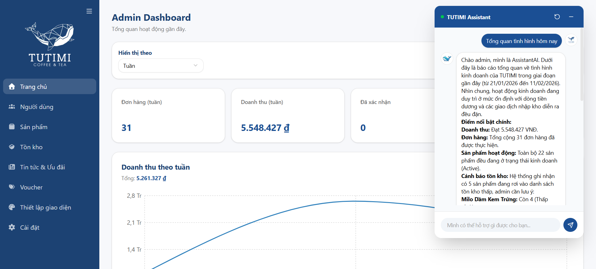
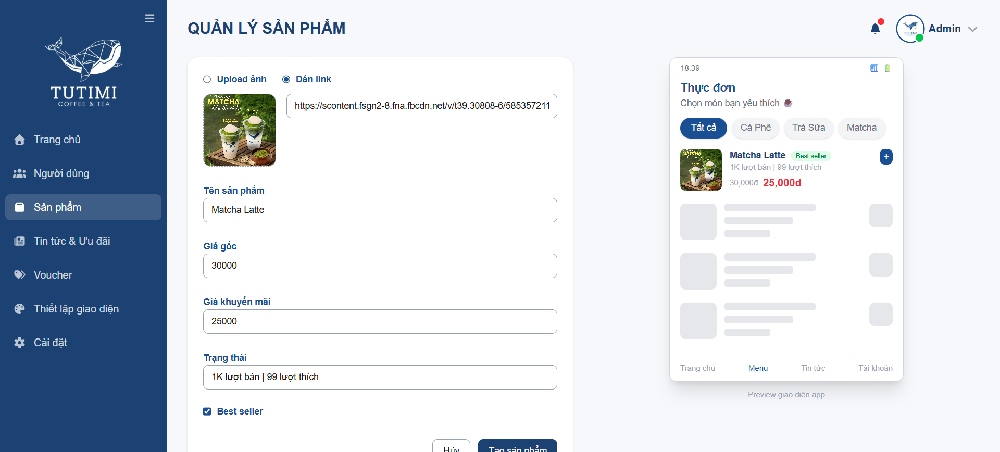
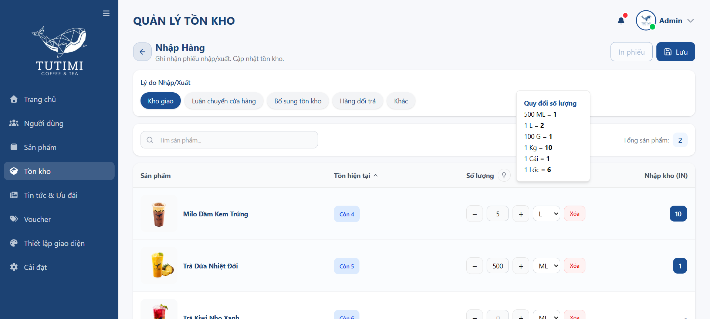
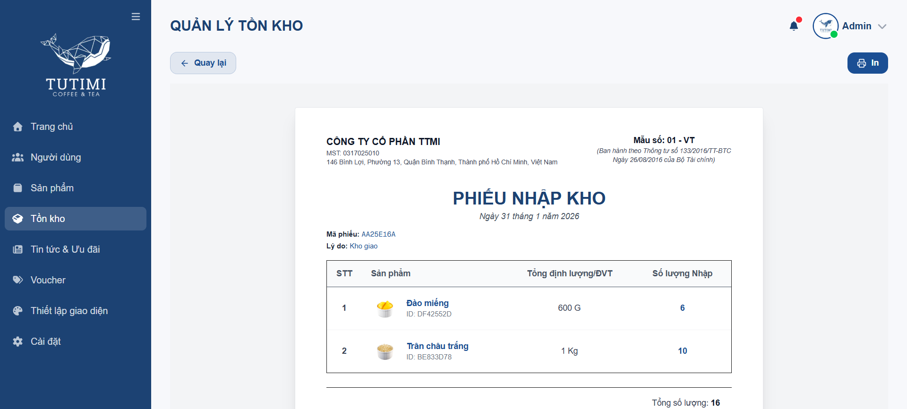
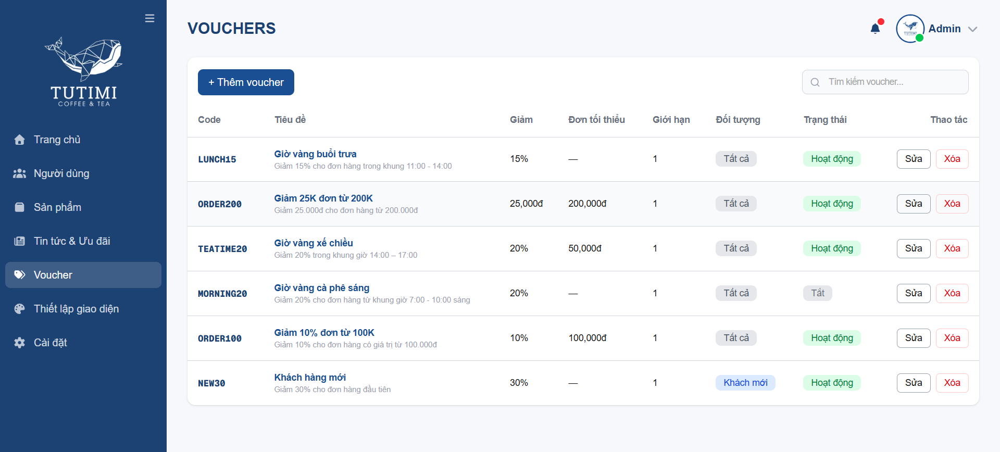
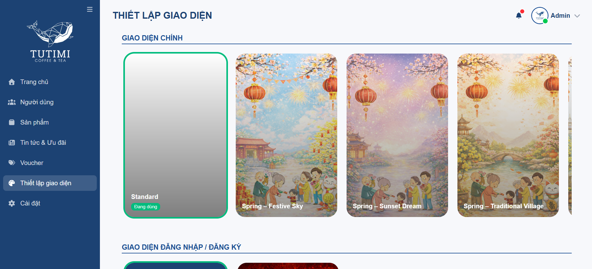

# TUTIMI ADMIN DASHBOARD


Tutimi Admin Dashboard — production-grade admin for coffee & tea e-commerce. Built with Next.js + Supabase + TanStack Query, it supports realtime inventory operations (atomic RPCs), bulk IN/OUT with unit conversion, receipt printing (A4), and an AI assistant for operational insights. Designed for operators: responsive UX, drawer-first edit flows, and enforced admin/RLS rules.

# [LINK DEMO🔗](https://tutimi-admin-dashboard.vercel.app/)

**Test Credentials:** `admin@gmail.com` / `Admin@123456`

## ✨ Highlights

- End-to-end admin workflows across dashboard, products, inventory, vouchers, news, themes, and users.
- Realtime sync strategy using Supabase channels + TanStack Query invalidation.
- Inventory operations optimized for throughput: bulk IN/OUT, unit conversion, receipt history, and A4 print flows.
- Responsive operational UX: desktop data tables, mobile cards, drawer-based edit actions.
- AI dashboard assistant with quick actions, context-aware responses, and product card rendering.
- Feature-first code organization with tested hooks/services/components for long-term maintainability.
- Express.js API service for backend orchestration and typed request/response contracts.

## 🧠 Architecture Overview

### High-level architecture



### Layer responsibilities

- `app/(admin)/*`: route shells and page composition.
- `app/features/*`: domain logic (services, hooks, components, types).
- `app/components/*`: shared cross-feature UI elements (drawers, previews, layout).
- `app/lib/*`: infrastructure utilities (Supabase client, storage helpers, formatters).
- `app/api/dashboard-ai/*`: AI orchestration and prompt/context assembly.
- `server/src/*`: Express.js API server (routes, repositories, validation, types).

### Data flow: inventory bulk write path



## 🧭 Feature Tour

### Dashboard and Analytics

- KPI cards for revenue, orders, and low-stock status.
- Revenue line chart by bucket (day, week, month, year).
- Orders status and inventory IN/OUT trend charts.
- Recent orders, top-selling products, and latest news preview.
- Flexible range filter with manual from/to override.

### Dashboard AI Assistant

- Floating button opens full chat drawer.
- Quick actions: overview, revenue summary, low-stock alerts, top products.
- API route: `app/api/dashboard-ai/route.ts`.
- Context builders: `buildProductsSectionForAI` + `buildInventorySectionForAI`.
- Structured response capability with product-card JSON block.

### Inventory Management

- Inventory list with category filter, search, sorting, and history drawer.
- Bulk IN/OUT with reason presets and custom reason.
- Validation guard for OUT operation (cannot exceed current stock).
- Receipt lifecycle: generate -> list history -> reprint -> print-ready A4 view.

Unit conversion rules in bulk flow:
- `500 ml -> 1`
- `1 L -> 2`
- `100 g -> 1`
- `1 kg -> 10`
- `1 item -> 1`
- `1 pack -> 6`

### Product Management

- Create, edit, delete products.
- Manage mode with bulk ON/OFF visibility updates.
- Image upload or image-link input.
- Live product preview matching client-facing style.

### News and Promotions

- CRUD for news entries with type, active status, and media input.
- Live preview aligned with client card layout.

### Vouchers

- CRUD with fixed/percent discount type.
- Validation fields: minimum order, max usage per user, new-user targeting.
- Live voucher preview.

### Themes and Branding

- Activate app themes and login branding.
- Banner switching by theme key.
- Dedicated create flow for new themes/assets.

### Users

- Admin user management from `profiles` (excluding admin accounts).
- Realtime refresh through Supabase subscription.

## ⚠️ Error Handling Strategy

- Explicit `loading/error` UI states + debounced search.
- Bulk inventory supports per-item failure visibility.
- Query/RPC errors surfaced with safe fallbacks.
- AI route wrapped in `try/catch` to prevent crash cascades.
- Destructive actions require confirmation.
- Planned: centralized error boundary + structured logging (e.g., Sentry).

## 🛡️ Security Considerations

- Supabase Auth + admin role gate.
- RLS enforced on business tables (DB-level protection)
- Inventory RPC restricted to admin policies.
- `GEMINI_API_KEY` stored server-side (API route only).
- Planned: rate limiting + audit logging for destructive actions.

## ⚡ Performance & Scalability Notes

- The dashboard leverages TanStack Query caching with targeted invalidation triggered by Supabase Realtime events.  
- Search inputs are debounced to reduce unnecessary refetches, and dashboard workloads use aggregated RPC endpoints with bounded reads (top N / recent N) for predictable performance.
- Currently, most admin lists use full-fetch for simplicity and small-to-medium datasets.  
- For larger datasets, the architecture can evolve toward server-side pagination, indexed filtering, and table virtualization where needed.

## Technical Decisions and Trade-offs

- **Supabase as unified backend (Auth + DB + Storage + Realtime + RPC)**
  - Why: accelerate product delivery with fewer moving parts.
  - Trade-off: tighter coupling to Supabase APIs and schema evolution.

- **TanStack Query + event-driven invalidation**
  - Why: consistent server-state model with predictable cache behavior.
  - Trade-off: small eventual-consistency window between event and refetch.

- **RPC functions for inventory write paths**
  - Why: atomic stock updates and clearer audit trail.
  - Trade-off: additional backend SQL/RPC maintenance overhead.

- **Feature-first architecture (`app/features/*`)**
  - Why: scalable ownership boundaries and easier onboarding.
  - Trade-off: deeper folder structure compared to flat page-based layout.

- **Drawer-based operational UI pattern**
  - Why: faster edit/delete flows on both desktop and tablet/mobile devices.
  - Trade-off: increased local UI state complexity.

## 🧪 Engineering Quality & Testing 

- **35 test files** in repository (Vitest + Testing Library).
- Coverage prorities búiness-critical paths:
  - Dashboard query/services and AI context builders
  - Inventory bulk logic and unit conversion rules
  - Print receipt flow and reusable formatting utils
  - Core drawer and confirmation patterns.
- Shared utilities (query keys, storage, formatters) tested independently.
- Clear separation between route shells, domain services, and UI components to enable isolated testing.

## Business Impact (Product Perspective)

- Reduced manual effort for stock operations via bulk workflows and receipt automation.
- Improved data reliability using RPC-based inventory mutations and realtime sync.
- Faster operational decision-making through consolidated dashboard analytics + AI assistant.

## 🛠️ Tech Stack

- Next.js 16 (App Router)
- React 19
- TypeScript
- Express.js
- Tailwind CSS 4
- TanStack Query 5
- Zustand
- Supabase (Auth, Database, Storage, Realtime, RPC)
- Recharts
- FontAwesome, Lucide
- Google Gemini (GenAI SDK)
- Vitest + Testing Library.

## Data Model Expectations (Supabase)

Tables:

- `profiles`
- `products`
- `categories`
- `orders`
- `order_items`
- `vouchers`
- `news`
- `app_themes`
- `app_brandings`
- `banners`
- `app_banner_settings`
- `inventory_transactions`

Views:

- `inventory_receipts`

RPC functions:

- `create_inventory_in`
- `create_inventory_out`
- `get_revenue_vn`
- `get_orders_count_vn`
- `get_inventory_in_out_vn`

Storage buckets used by app:

- `products` (product images, news images, themes, banners, branding assets)

## Authentication and Authorization

- Supabase email and password login.
- Admin gate enforced by `profiles.role === "admin"`.
- Non-admin users are redirected to login.

## 🚀 Local Setup

Prerequisites:
- Node.js 18+
- Supabase project
- Express.js runtime (Node server)

1. Install dependencies
   - npm install

2. Configure environment
   - Create `.env.local`
   - Add:
     - NEXT_PUBLIC_SUPABASE_URL
     - NEXT_PUBLIC_SUPABASE_ANON_KEY
     - GEMINI_API_KEY

3. Run the app
   - npm run dev
   - npm run server:dev

## Scripts

- `npm run dev` - Start development server
- `npm run server:dev` - Start Express API server (watch mode)
- `npm run build` - Build production bundle
- `npm run start` - Start production server
- `npm run server:start` - Start Express API server (production)
- `npm run lint` - Run ESLint
- `npm run test` - Run unit/component tests once
- `npm run test:watch` - Run tests in watch mode
- `npm run test:coverage` - Run tests with coverage report
- `npm run test:ui` - Open Vitest UI

## Project Structure

Note: backend service lives in `server/` (Express.js API).

```
app/
├── (admin)/                        # Admin routes
│   ├── dashboard/                  # Admin dashboard
│   ├── products/
│   │   └── create/                 # Product management
│   ├── inventory/                  # Inventory module
│   │   ├── bulk/[type]/            # Bulk import/export
│   │   ├── history/                # Inventory history
│   │   └── print/[receiptId]/      # Print receipt
│   ├── news/
│   │   └── create/
│   ├── vouchers/
│   │   └── create/
│   ├── themes/
│   │   └── create/
│   └── users/
│
├── (auth)/
│   └── login/              # Authentication
│
├── api/
│   └── dashboard-ai/       # AI dashboard endpoint
│
├── components/             # Shared layout components
├── features/               # Business logic by domain
│   ├── dashboard/
│   ├── inventory/
│   ├── products/
│   ├── news/
│   ├── vouchers/
│   ├── themes/
│   └── users/
│
├── hooks/                  # Custom React hooks
├── lib/                    # App-level utilities (Supabase, query keys, formatters)
├── store/                  # Global state management
│
components/
└── ui/                     # Reusable UI components (design system)
│
lib/                        # Shared root utilities
│
server/
└── src/                    # Express API (routes/controllers/services/repositories)
│
public/
├── images/
└── screenshots/
│
test/                       # Unit & integration tests
```

## 🧩 Folder Responsibilities

- `app/(admin)/`, `app/(auth)/`, `app/api/` → Route groups and API endpoints (App Router)
- `app/features/` → Domain modules (api/services/hooks/components/types)
- `app/components/` → Shared admin UI blocks (drawers, previews, layout pieces)
- `app/lib/` + `app/hooks/` + `app/store/` → Client infrastructure (helpers, custom hooks, global UI state)
- `components/ui/` + `lib/` → Reusable base UI primitives and root shared utilities
- `server/src/` → Express backend layers (routes, controllers, services, repositories, providers, middlewares)
- `test/` + `*.test.ts(x)` → Test setup and unit/component coverage

## Screenshots

### 🤖 Dashboard AI Assistant


### 🛒 Create Product


### 🧾 Bulk Inventory Input (IN)


### 📦 Inventory Receipt (Print A4)


### 🎟️ Voucher Management


### 🎨 Theme Management


## 👨‍💻 My Role

- Built the full admin product as a solo developer.
- Implemented inventory and receipt workflows end to end.
- Designed responsive UI with reusable drawer patterns and previews.
- Integrated Supabase services (Auth, Realtime, RPC, Storage).
- Structured the codebase for maintainability and fast iteration.

## 📝 Notes for Reviewers

- Primary UI content is Vietnamese because target operators are local admin users.
- Replace environment values to connect to your own Supabase project.
